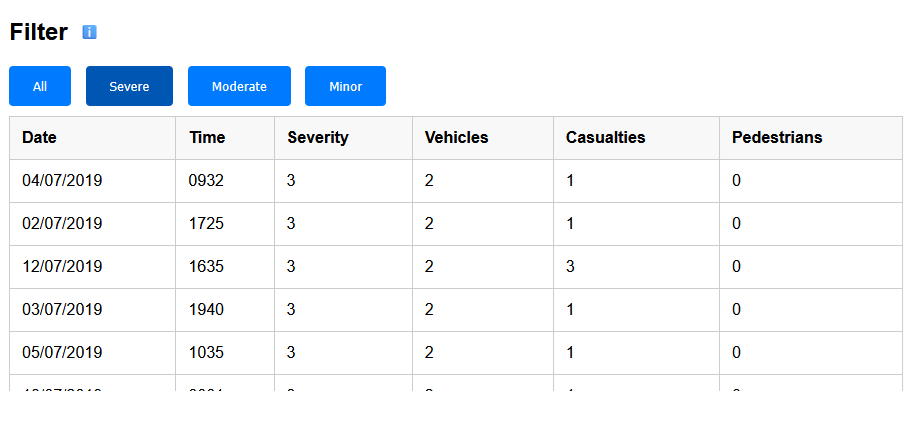
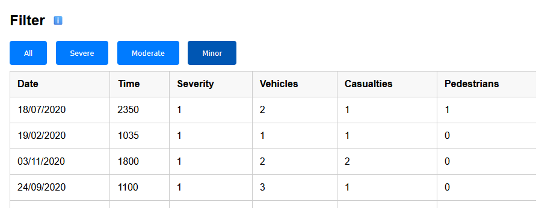

# Implementation
## Completed By Max Mander

## Introduction
The dataset used for this system is vast. It has a total number of entries amounting to 4,143 as of 6/29/2024. Each entry in this data set shares a lot of valuable information for each accident such as the date, time, severity, and location (coordinates) of each collision. However, there is one issue with this dataset which is that there information regarding the location of each collision is only coordinates. This makes it more complex to implement a search feature allowing the user to find collisions in a set location rather than by specific coordinates. Each entry found in this dataset was reported to the police who then shared the information regarding the collision with the council. Also, this dataset excludes any collisions that do not involve personal injury.

## Project Structure

```
└── 📁TrafficAccidents
    └── index.html
    └── map.html
    └── script.js
    └── style.css
    └── indexStyle.css
    └── table.html
```

# index.hmtl:
The role of index.html in this project is to provide the user with a simple introduction to the system. It has a small amount of text explaining what the application does. It also lets the user decide whether they want to view the data as a table or as a map.


# map.html:
The role of map.html in this project is to gather the data from open data Bristol and plot each entry on a map. It also asks the user for their current location which is also then plotted on the map. Each marker plotted on the map can be clicked which provides the user with the information regarding each collision such as date, time, severity, vehicles, casualties, and pedestrians. 

jslint warnings for map.html:
1. [JSLint was unable to finish] Unexpected 'let'.
    for (let i = 0; i < features.length; i++) {
1: 1
2. Line is longer than 80 characters.
const MY_TOKEN = "pk.eyJ1IjoibW1heHg3MyIsImEiOiJjbThyY3Y2a2IwbjZnMmxzaDc1NWZyeDZyIn0.YHCtu5k5YG2A8DoI7477LA";
7: 5
3. Unexpected 'for'.
    for (let i = 0; i < features.length; i++) {
18: 1
4. Line is longer than 80 characters.
            // Create popup with detailed info attatched to that specific map marker
20: 1
5. Line is longer than 80 characters.
                <strong>Date:</strong> ${a.DATE_ ? new Date(a.DATE_).toLocaleDateString() : "Unknown"}<br>
32: 1
6. Line is longer than 80 characters.
        let url = "https://maps2.bristol.gov.uk/server2/rest/services/ext/ll_transport/MapServer/41/query?where=1%3D1&outFields=DATE_,TIME,SEVERITY,VEHICLES,CASUALTIES,X,Y,RENDER&outSR=4326&f=json";
33: 1
7. Line is longer than 80 characters.
        fetch(url, { method: 'GET', headers: { 'Accept': 'application/json' } }) //requests data
33: 30
8. Use double quotes, not single quotes.
        fetch(url, { method: 'GET', headers: { 'Accept': 'application/json' } }) //requests data
33: 48
9. Use double quotes, not single quotes.
        fetch(url, { method: 'GET', headers: { 'Accept': 'application/json' } }) //requests data
33: 58
10. Use double quotes, not single quotes.
        fetch(url, { method: 'GET', headers: { 'Accept': 'application/json' } }) //requests data
43: 1
11. Line is longer than 80 characters.
            var lat = urlParams.get('lat') ? parseFloat(urlParams.get('lat')) : defaultLat;
43: 37
12. Use double quotes, not single quotes.
            var lat = urlParams.get('lat') ? parseFloat(urlParams.get('lat')) : defaultLat;
43: 71
13. Use double quotes, not single quotes.
            var lat = urlParams.get('lat') ? parseFloat(urlParams.get('lat')) : defaultLat;
44: 1
14. Line is longer than 80 characters.
            var lon = urlParams.get('lon') ? parseFloat(urlParams.get('lon')) : defaultLon;
44: 37
15. Use double quotes, not single quotes.
            var lon = urlParams.get('lon') ? parseFloat(urlParams.get('lon')) : defaultLon;
44: 71
16. Use double quotes, not single quotes.
            var lon = urlParams.get('lon') ? parseFloat(urlParams.get('lon')) : defaultLon;
48: 26
17. Use double quotes, not single quotes.
              container: 'map',


# table.hmtl:
The role of table.html in this project is to gather the data from open data Bristol and plot each entry on a table. It also allows the user to sort the table by the date, severity, and number of casualties. As well as being able to sort the table, the user can also filter the table depending on the severity of the collision (Servere, Moderate, and Minor).

jslint warnings for table.html:
1. [JSLint was unable to finish] Wrap the parameter before '=>' in parens.
accidentData = data.features.map(feature => feature.attributes); //This array holds the data of each collision
1: 1
2. Line is longer than 80 characters.
const apiUrl = "https://maps2.bristol.gov.uk/server2/rest/services/ext/ll_transport/MapServer/41/query?where=1%3D1&outFields=DATE_,TIME,SEVERITY,VEHICLES,CASUALTIES,PEDESTRIAN&outSR=4326&f=json";
14: 1
3. Line is longer than 80 characters.
accidentData = data.features.map(feature => feature.attributes); //This array holds the data of each collision
15: 1
4. Line is longer than 80 characters.
filteredData = [...accidentData]; // A copy of accidentData is made so that it can be filtered and sorted without modifying the original data
25: 1
5. Line is longer than 80 characters.
  const tableBody = document.querySelector("#accidentsTable tbody"); //selects the body of the table
28: 1
6. Line is longer than 80 characters.
  const startIndex = (currentPage - 1) * rowsPerPage; // gets the starting location (if on page 4, starting index is 36)
29: 1
7. Line is longer than 80 characters.
  const endIndex = startIndex + rowsPerPage; // gets the ending location (if on page 4, ending index is 48)
30: 1
8. Line is longer than 80 characters.
  const paginatedData = data.slice(startIndex, endIndex); // this gets the required data only
40: 1
9. Line is longer than 80 characters.
  const row = document.createElement("tr"); // creates a row in the table for the below attributes to be plotted
53: 1
10. Line is longer than 80 characters.
    renderPaginationControls(data.length); //shows the controls to go to the next table page as well as current page number
62: 1
11. Line is longer than 80 characters.
    filteredData = accidentData.filter(accident => accident.SEVERITY === severity); // is set to show either severity level 1, 2, or 3
84: 1
12. Line is longer than 80 characters.
    sortState.date = sortState.date === "desc" ? "asc" : "desc";//toggles sorting order
88: 1
13. Line is longer than 80 characters.
      //depending on the sort state, the dates are sorted from oldest to most recent or most recent to oldest
94: 1
14. Line is longer than 80 characters.
      //depending on the sort state, the severity is sorted from highest to lowest or lowest to highest
95: 1
15. Line is longer than 80 characters.
      return sortState.severity === "desc" ? b.SEVERITY - a.SEVERITY : a.SEVERITY - b.SEVERITY;
101: 1
16. Line is longer than 80 characters.
      return sortState.casualties === "desc" ? b.CASUALTIES - a.CASUALTIES : a.CASUALTIES - b.CASUALTIES;
117: 1
17. Line is longer than 80 characters.
    <button onclick="changePage(-1)" ${currentPage === 1 ? "disabled" : ""}>Previous</button>
119: 1
18. Line is longer than 80 characters.
    <button onclick="changePage(1)" ${currentPage === totalPages ? "disabled" : ""}>Next</button>
121: 1
19. Line is longer than 80 characters.
  //user cannot go below page 1 or over the last page as the buttons will be disabld


# script.js:
script.js is used in this project to run the function that gathers the location of the user so that it can be plotted on the map.

jslint warnings for script.js:

1. Undeclared 'navigator'.
    if (navigator.geolocation) {//checks if geolocation is available
4: 7
2. Undeclared 'navigator'.
      navigator.geolocation.getCurrentPosition(
5: 20
3. Use 'function (...)', not '(...) =>' when arrow functions become too complex.
        (position) => {
11: 11
4. Undeclared 'map'.
          map.flyTo({
14: 13
5. Expected property 'essential' to be ordered before property 'zoom'.
            essential: true
18: 15
6. Undeclared 'mapboxgl'.
          new mapboxgl.Marker({ color: "red" })
20: 20
7. Undeclared 'map'.
            .addTo(map);
22: 17
8. Use 'function (...)', not '(...) =>' when arrow functions become too complex.
        (error) => {
24: 11
9. Undeclared 'alert'.
          alert("Error getting location: " + error.message);
28: 7
10. Undeclared 'alert'.
      alert("Geolocation is not supported by this browser.");

# style.css:
style.css is used in this project to improve the consistency and visual clarity of the web page as it sets the font used, colours used, and alignment of each element on the page.


## Software Architecture


## Bristol Open Data API


# User guide

## Use Case 1: View accident hot-spots

The user accesses the website and selects the option to view the data via map


The Map displays the collisions and the user can easily see which areas have the most collisions


The user can then share their location with the application which is then plotted on the map


## Use Case 2: View Detailed Crash Reports
The user Accesses the website and selects the option to view the data via table


The table containing the collision information is displayed to the user


The user can then filter the table by severity


## Use Case 3: Filter by Severity
The user Accesses the website and selects the option to view the data via table


The user can then filter the table by severe collisions


The user can then filter the table by Moderate collisions


The user can then filter the table by Minor collisions



