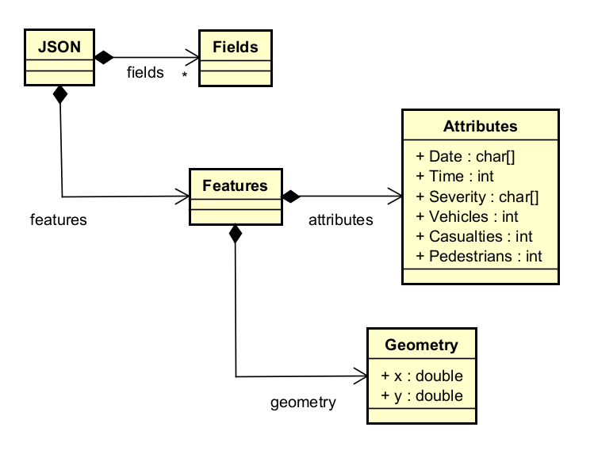

# Implementation

## Introduction
TODO: Describe the system implemented (Describe the dataset. Are there any known issues? Describe any configuration data).

The dataset used for this system is vast. It has a total number of entries amounting to 4,143 as of 6/29/2024. Each entry in this data set shares a lot of valuable information for each accident such as the date, time, severity, and location (coordinates) of each collision. However, there is one issue with this dataset which is that there information regarding the location of each collision is only coordinates. This makes it more complex to implement a search feature allowing the user to find collisions in a set location rather than by specific coordinates. Each entry found in this dataset was reported to the police who then shared the information regarding the collision with the council. Also, this dataset excludes any collisions that do not involve personal injury.

## Project Structure
TODO: Provide an outline of the project folder structure and the role of each file within it.
provide a table listing the number of jslint warnings/reports for each module.

```
└── 📁TrafficAccidents
    └── index.html
    └── map.html
    └── script.js
    └── style.css
    └── table.html
```

## Software Architecture
TODO: Describe the major components of your architecture. Are any particular architectural styles being used?


## Bristol Open Data API
TODO: Document each query to Bristol Open Data


TODO: Repeat as necessary

# User guide
TODO: Explain how each use-case works by providing step-by-step screenshots for each use-case. This should be based on a tested scenario.
