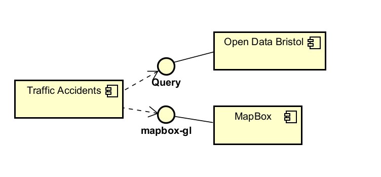
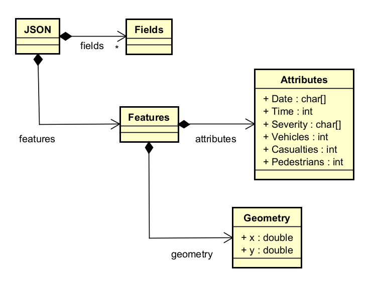
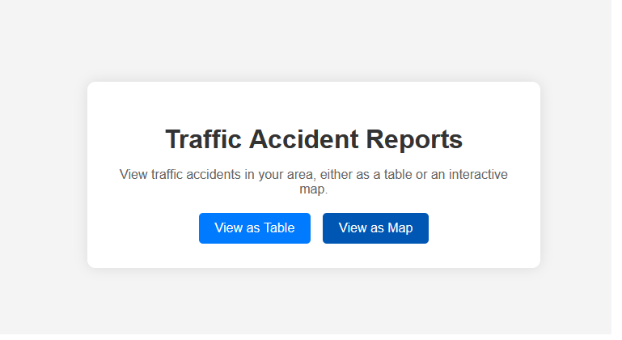
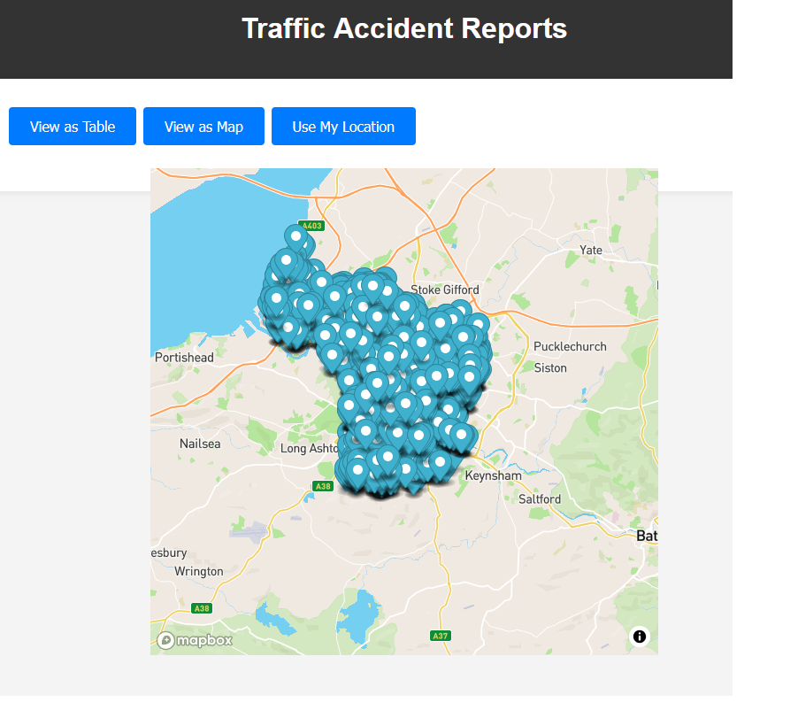
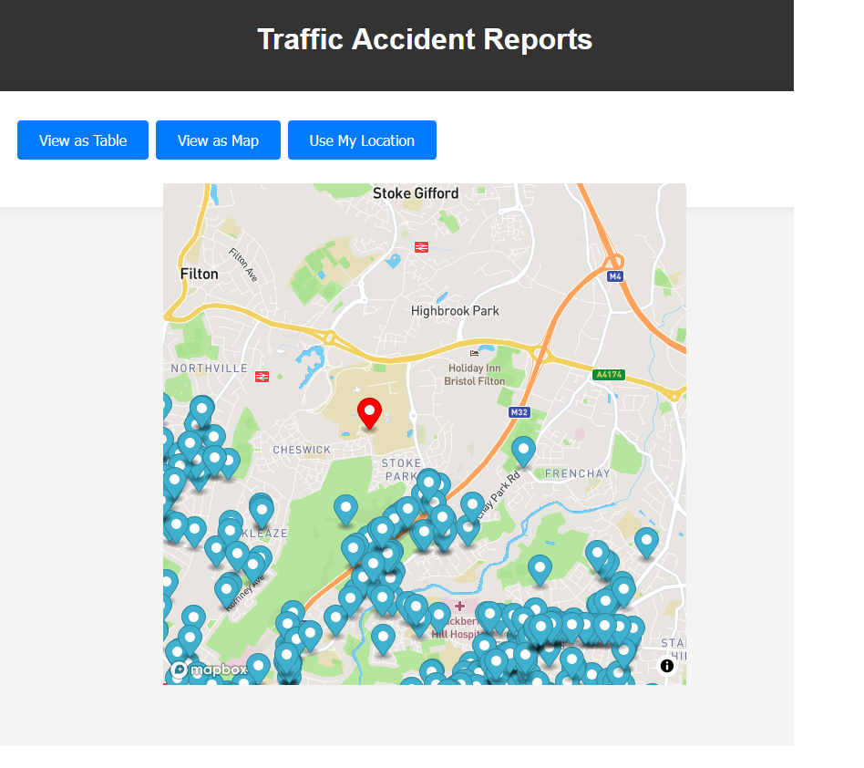
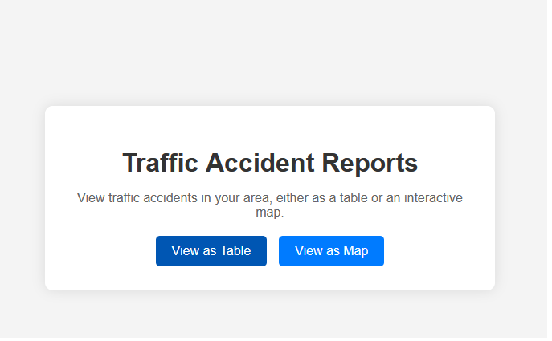
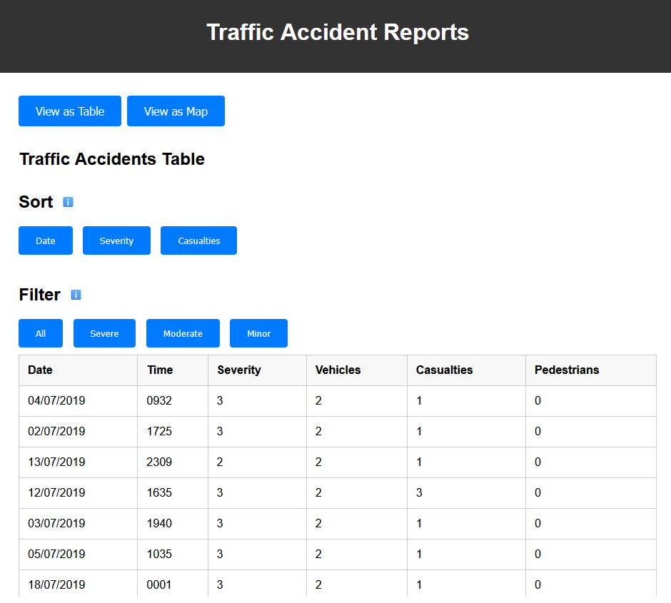
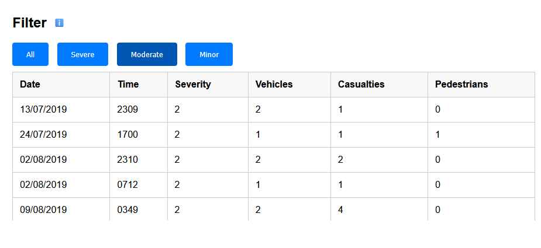

# Implementation

## Introduction
The dataset used for this system is vast. It has a total number of entries amounting to 4,143 as of 6/29/2024. Each entry in this data set shares a lot of valuable information for each accident such as the date, time, severity, and location (coordinates) of each collision. However, there is one issue with this dataset which is that there information regarding the location of each collision is only coordinates. This makes it more complex to implement a search feature allowing the user to find collisions in a set location rather than by specific coordinates. Each entry found in this dataset was reported to the police who then shared the information regarding the collision with the council. Also, this dataset excludes any collisions that do not involve personal injury.

## Project Structure

```
└── 📁TrafficAccidents
    └── index.html
    └── map.html
    └── script.js
    └── style.css
    └── table.html
```

index.hmtl:
The role of index.html in this project is to provide the user with a simple introduction to the system. It has a small amount of text explaining what the application does. It also lets the user decide whether they want to view the data as a table or as a map.

jslint warnings for index.html:


map.html:
The role of map.html in this project is to gather the data from open data Bristol and plot each entry on a map. It also asks the user for their current location which is also then plotted on the map. Each marker plotted on the map can be clicked which provides the user with the information regarding each collision such as date, time, severity, vehicles, casualties, and pedestrians. 

jslint warnings for map.html:

table.hmtl:
The role of table.html in this project is to gather the data from open data Bristol and plot each entry on a table. It also allows the user to sort the table by the date, severity, and number of casualties. As well as being able to sort the table, the user can also filter the table depending on the severity of the collision (Servere, Moderate, and Minor).

jslint warnings for table.html:

script.js:
script.js is used in this project to run the function that gathers the location of the user so that it can be plotted on the map.

jslint warnings for script.html:

style.css:
style.css is used in this project to improve the consistency and visual clarity of the web page as it sets the font used, colours used, and alignment of each element on the page.


## Software Architecture


## Bristol Open Data API


# User guide

## Use Case 1: View accident hot-spots

The user accesses the website and selects the option to view the data via map


The Map displays the collisions and the user can easily see which areas have the most collisions


The user can then share their location with the application which is then plotted on the map


## Use Case 2: View Detailed Crash Reports
The user Accesses the website and selects the option to view the data via table


The table containing the collision information is displayed to the user


The user can then filter the table by severity

